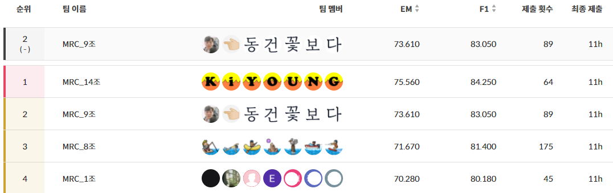

# KLUE Open-Domain Question Answering, Naver Boostcamp AI Tech 2기

## Competition Abstract

🤓 KLUE MRC(Machine Reading Comprehension) Dataset으로 Open-Domain Question Answering을 수행하는 Task.  
🤓 질문에 관련된 문서를 찾아주는 Retriever와 관련된 문서를 읽고 답변을 하는 Reader로 구성.  
🤓 Leaderboard에서 Public 240개, Private 360개로 평가가 이루어짐.  
🤓 하루 10회로 모델 제출 제한

## [Competition Report(PDF)](competition_results/nlp-p-p09_mrc.pdf)

## Our solutions

- retrieval
  - Elastic search
  - Pororo NER
- Data Augmentation
  - Negative Sampling
  - Question Generation
- Post Processing
  - Top-k Passages Seperate
  - Answer scoring with softmax
  - Similiarity scoring with KSS(Korean Sentence Spliter)
  - Other post-processing via Mecab
- Ensemble
  - Hard voting
  - Post processing

## 최종 순위 2등!



---

## Installation

- python module: requirements.txt
- Elatsic Search: [Installation docs](https://www.elastic.co/guide/en/elasticsearch/reference/current/targz.html)
- Mecab: [Korean mecab doc](https://bitbucket.org/eunjeon/mecab-ko-dic/src/master/)

## Set environment

- Elastic Search
  - root userelastic_test.py
  ```
  python elastic_test.py
  ```
  - non-root user
  ```
  ./bin/elasticsearch -d -p pid
  ```
- Genertate NER tagged files

```
# outputs = train_tagged.csv, inference_tagged.csv
python make_ner_tag.py
```

- Generate K-fold trainig files

```
# outputs = fold{n}.csv
python make_ner_tag.py
```

- Indexing wikipedia files using Elastic search

```
python elastic_search.py
```

- wandb setting

```python
# default wandb setting in train.py
run = wandb.init(project= 'klue', entity= 'quarter100', name= f'Any training name')
```

- Copy qg_dataset in ../data directory

## Train model

```
python train.py
```

Models are saved in "./models/train_dataset\_{experiment_name}/".

## Inference

```
python inference.py --output_dir ./outputs/test_dataset/ --dataset_name ../data/test_dataset/ --model_name_or_path ./models/train_dataset/ --do_predict
```

Prediction csv files are saved in "./outputs/test_dataset/".

## Ensemble

- Hard voting
- Ensemble result is saved in "./submission_fold_total.csv".

## Docs

- [Question Generation](question_generation/README.md)

## Members

[김다영](https://github.com/keemdy), [김다인](https://github.com/danny980521), [박성호](https://github.com/naem1023), [박재형](https://github.com/Jay-Ppark), [서동건](https://github.com/donggunseo), [정민지](https://github.com/minji-o-j), [최석민](https://github.com/RockMiin)

## Advisors

[박채훈 멘토님](https://github.com/ddehun)
